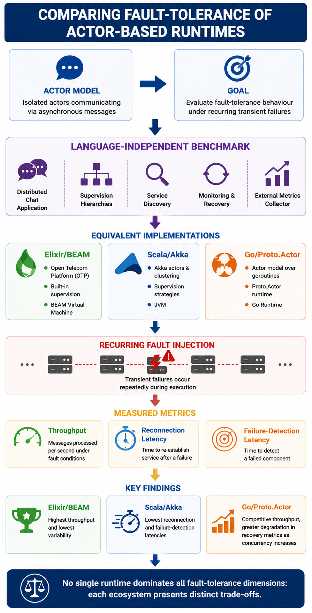
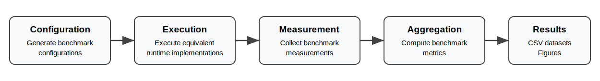

# Benchmarking Fault-Tolerance Characteristics of Actor-Based Runtimes

This repository contains the source code, benchmark framework, and experimental artefacts accompanying the paper:

> **Benchmarking Fault-Tolerance Characteristics of Actor-Based Runtimes**
> **Luís Nogueira** and **Jorge Coelho**
> *Computers (MDPI), 2026*
> *(DOI to be added after publication)*

<p align="center">
  
  <br>
  <em>Graphical abstract of the benchmarking framework.</em>
</p>

The project provides a language-independent benchmarking framework for evaluating the fault-tolerance characteristics of actor-based distributed systems under recurring transient failures.

Three functionally equivalent benchmark implementations are provided:

* **Elixir / BEAM**
* **Scala / Akka**
* **Go / Proto.Actor**

All implementations execute the same distributed chat application, use identical benchmark configurations, and are evaluated through a common external statistical component. This architecture enables fair, reproducible, and language-independent comparisons across actor runtimes.

---

# Repository Structure

```text
benchmark/
│
├── assets/                  Documentation figures
├── scripts/                 Automation scripts
├── stats/                   Configuration generator, statistics and analysis
│   ├── generated_configs/   Generated benchmark configurations
│   └── results/             Aggregated benchmark results
│
├── elixir/                  Elixir / BEAM implementation
├── scala-akka/              Scala / Akka implementation
└── go-protoactor/           Go / Proto.Actor implementation
```

---

# Benchmark Workflow

<p align="center">
  
</p>

The benchmark workflow consists of five stages:

1. Benchmark configurations are generated automatically as YAML files.
2. Each generated configuration is executed by the selected runtime implementation.
3. The statistical component collects benchmark measurements.
4. The collected measurements are aggregated into CSV datasets.
5. The resulting datasets are used to reproduce the analyses reported in the accompanying paper.

---

# Benchmark Metrics

The benchmark evaluates three complementary dimensions of fault tolerance:

* **Throughput under recurring transient failures**
* **Client reconnection latency**
* **Failure detection latency**

Faults are injected automatically according to configurable benchmark parameters, allowing reproducible comparisons across all runtime implementations.

---

# Tested Environment

The benchmark was developed and validated using the following software versions.

| Component   | Version |
| ----------- | ------- |
| Elixir      | 1.18.3  |
| Erlang/OTP  | 27      |
| Scala       | 3.3.5   |
| Akka        | 2.10.2  |
| Go          | 1.23.4  |
| Proto.Actor | 0.4.0   |
| Python      | 3.12    |
| RabbitMQ    | 4.x     |

---

# Reproducing the Experiments

## Prerequisites

* A local **RabbitMQ** instance.
* **Python 3**.
* **Elixir/Erlang**.
* **Scala**, **sbt**, and a compatible **JDK**.
* **Go**.

For Scala, copy `scala-akka/.env.example` to `scala-akka/.env` and set your own `AKKA_KEY` (Akka licence key). The actual licence key is intentionally not included in the repository.

By default, the RabbitMQ broker and the Akka cluster host use `localhost` / `127.0.0.1`. For distributed deployments, configure the appropriate environment variables before running the benchmark.

## Steps

Create the Python virtual environment used by the statistical tools:

```bash
cd stats

python3 -m venv venv
source venv/bin/activate
pip install -r requirements.txt
```

Generate the benchmark configurations:

```bash
python3 generate_configs.py
```

Execute the complete benchmark campaign:

```bash
cd ../scripts

./clean.sh
./all_tests.sh
```

The `all_tests.sh` script executes the benchmark campaign for the three runtime implementations sequentially. Each implementation builds itself automatically when required.

After all benchmark campaigns have completed, aggregate the experimental data and generate the publication figures:

```bash
cd ../stats

python3 aggregator.py
python3 plotting.py
```

The aggregated CSV datasets are written to `stats/results/`. Generated figures are stored under `stats/results/figures/`.

Each runtime implementation may also be executed independently using its own `run_benchmark.sh` or `run_experiment.sh` scripts.

> **Note:** `clean.sh` removes all generated benchmark results, including the contents of `stats/results/` and each implementation's `scripts/results/` directory. If you wish to preserve previously generated datasets, make a copy before running the script.

---

# Repository Contents

The repository includes:

* three equivalent benchmark implementations;
* benchmark configuration generators;
* automation scripts for benchmark execution;
* statistical processing and aggregation tools;
* the datasets and analysis tools used to reproduce the results reported in the accompanying paper.

---

# Research Contribution

Unlike traditional actor-system benchmarks, which primarily evaluate throughput or message latency, this benchmark focuses on runtime behaviour under recurring transient failures.

Its main contributions are:

* a language-independent benchmarking methodology;
* equivalent implementations across multiple actor ecosystems;
* reproducible fault-injection scenarios;
* an external statistical component that minimises measurement interference;
* a fair comparison of actor runtime fault-tolerance mechanisms.

---

# Citation

If you use this benchmark in your research, please cite the accompanying paper.

The BibTeX entry will be added after publication.

---

# License

This project is distributed under the MIT License.
